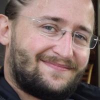

# Ueli Niederer



## Kurze Biographie

Als gelernter Elektroniker habe ich mich früh für Computer und Software interessiert. Meine absolute Leidenschaft gilt der technischen Informatik sowie der Methodik im Bereich des Software-Engineerings. Ich liebe es Systeme zu entwerfen, zu analysieren und zu verbessern.
Heute bin ich teilweise als Lehrer im Informatikbereich tätig, teilweise helfe ich als selbstständiger Software- und Systemingenieur meinen Kunden dabei ihre Träume zu verwirklichen.

### Meine Ausbildungsschritte

- 2002: Abschluss als Elektroniker EFZ
- 2011: Abschluss als BSc FHO in System Engineering with specialization in Computer Science (schrecklich sperriger Titel ;-))
- 2015: Abschluss als MSc FHO in Engineering with specialization in industrial technologies - Natürlich auch hier wieder mit dem Schwerpunkt Computer Science.
- 2021: CAS Lehrer der höheren Fachschule/BKU im Nebenberuf

### Mein Motto

> Give a man a fish and you feed him for a day; teach a man to fish and you feed him for a lifetime
> *Englisches Sprichwort*

## Sprachen die ich spreche

- Deutsch
- Englisch
- Französisch (am verblassen)

## Social Media Profile

- [Linked In](https://www.linkedin.com/in/ueli-niederer/)

## Hallo Welt in meiner Lieblingssprache

Eigentlich hab ich keine lieblingssprache, sondern bin zumindest im Software Engineering bemüht polyglott unterwegs zu sein. Mein Beispiel mach ich einfach mal in `C`:

```c
#include <stdio.h>

int main(void) {
    printf("Hallo Welt!");

    return 0;
}
```
